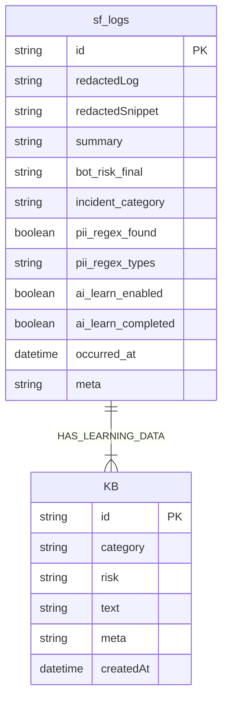

# 🧠 AIM SECURITYFLOW

## *Aim the Security of Finance*

### **AI 기반 금융 보안 로그 자율 분석·학습 파이프라인**

**2025 AI Agent 해커톤 출품작 – AIM 팀(AI + IM)**
SecureFlow는 금융·기업 보안 환경에서 들어오는 보안 로그를
**AI가 스스로 수집 → 분석 → 판단 → 학습 → 대응**하는
**완전 자동화 보안 분석 파이프라인**입니다.

---

# 🚀 SecureFlow Overview

SecureFlow는 다음을 전자동으로 수행합니다:

* 정규식 기반 PII(개인정보) 정밀 탐지 + 100% 마스킹
* Upstage Solar Pro 2 기반 위험도/카테고리 판단
* n8n 기반 전처리 → PII 탐지 → 위험도 분류 → 학습 여부 판단 → KB 저장
* Express 백엔드 API + SSE 기반 실시간 스트림
* React 대시보드에서 위험도·학습 상태 실시간 시각화
* Security KB 자동 학습 & 유사 사례 검색
* 12시간 주기 로그 Sanitized 백업(XLSX) + 이메일 발송

---

# 🧩 시스템 아키텍처

```
          [외부 시스템 로그]
                   ↓
       ┌───────────────┐
       │     n8n       │
       │ Raw Collector │
       │ Raw Worker    │
       │ PII 탐지       │
       │ 위험도 판단     │
       │ 학습큐 분류     │
       └───────────────┘
                   ↓
           [Express Backend]
     logs.json (대시보드 캐시)
     ↕ SSE 실시간 스트림
     kb.json (KB 저장)
                   ↓
          [React Live Dashboard]
```

---

# 📦 프로젝트 구조 (최신 버전)

```
im-bank-n8n-agent/
│
├── backend/
│   ├── server.js               # Express API / SSE / KB 관리
│   └── data/
│       ├── logs.json           # 대시보드용 캐싱 (원본 PII는 없음)
│       └── kb.json             # 보안 학습 지식베이스
│
├── frontend/
│   ├── src/App.js              # SSE 실시간 UI
│   ├── src/App.css
│
├── n8n-workflows/
│   ├── SecureFlow – Raw Collector.json
│   ├── SecureFlow – Raw Worker.json
│   ├── SecureFlow – 학습 워커.json
│   ├── SecureFlow – Full Auto Analysis.json
│   └── SecureFlow – sf_logs_backup_and_cleanup_12h.json
│
└── README.md
```

### ❗ 중요한 구조 변경 (최신 반영)

* **sf_logs의 실질 저장소는 n8n Data Table/Store**
  → 백엔드에서는 **읽기만** 한다 (수신 후 SSE 브로드캐스트).

* **logs.json은 대시보드 캐시 용도**
  → 원본 PII 없음, 항상 redactedLog 기반으로만 저장됨.

* 학습 데이터(KB)는 항상 **PII 제거된 redactedLog 기반 text만 저장**됨.

---

# ⚙️ 핵심 기능

| 기능                   | 설명                                     |
| -------------------- | -------------------------------------- |
| 🔍 PII 탐지 및 마스킹      | 이메일/전화/주민번호/카드번호 탐지 후 완전 마스킹           |
| 🧠 AI 위험도 분석         | Solar Pro 2 기반 High·Medium·Low·Safe 분류 |
| 🔄 자동화 파이프라인         | Webhook → 분석 → 저장 → 학습 → 상태 동기화        |
| 📚 Security KB 자동 학습 | PII 없는 로그만 학습, KB에 저장                  |
| 📊 실시간 대시보드          | SSE 기반 지연 0초 실시간 스트림                   |
| 🚨 High Risk 경보      | 이메일·Slack 연동                           |
| 🧼 12h 주기 백업         | Sanitizer → XLSX → 이메일 + 내부 저장         |

---

# 🔗 주요 API 엔드포인트

| Method | Endpoint                | 설명                   |
| ------ | ----------------------- | -------------------- |
| POST   | `/api/logs`             | n8n에서 분석 완료된 로그 push |
| GET    | `/api/logs`             | 대시보드용 로그 조회          |
| PUT    | `/api/logs/:id`         | 학습 완료 상태 변경          |
| POST   | `/security-kb`          | KB 항목 저장             |
| GET    | `/security-kb/examples` | 유사 학습 사례 조회          |
| GET    | `/events`               | SSE 실시간 스트림          |

---

# 🧰 기술 스택

| 영역         | 기술                                          |
| ---------- | ------------------------------------------- |
| Backend    | Node.js(Express), SSE, JSON Storage         |
| Frontend   | React, TailwindCSS, Chart.js                |
| AI 분석      | Upstage **Solar Pro 2**                     |
| Automation | n8n Workflow Engine                         |
| Infra      | Naver Cloud                                 |
| Storage    | n8n Data Table(sf_logs), kb.json, logs.json |

---

# 🧩 전체 파이프라인 흐름

```mermaid
flowchart TD
    A[Webhook 수집] --> B[PII 탐지 및 마스킹]
    B --> C[위험도 분류 (Solar 룰 기반)]
    C --> D[백엔드 저장]
    D --> E{High Risk?}
    E -->|Yes| F[Slack/Email 경보]
    C --> G{학습 대상?}
    G -->|Yes| H[학습 텍스트 생성]
    H --> I[Security KB 저장]
    I --> J[로그 상태 업데이트]
    D --> K[React Dashboard SSE 반영]

```

---

# 🧬 ERD (최신 필드 반영)



---

# 🧼 12시간 주기 자동 백업

### ✔ 동작 방식

1. n8n에서 sf_logs **최근 12h 로그 조회**
2. Backup Sanitizer에서 모든 로그 redactedLog 기준 재마스킹
3. XLSX 변환
4. SMTP 이메일 전송(TLS 암호화)
5. 내부 디스크에도 백업 저장(옵션)

### ✔ 원본 PII는 백업하지 않음

→ redactedLog만 사용
→ 내부 저장 + 이메일 모두 동일하게 안전

---

# 💻 실행 방법

```bash
# Backend
cd backend
npm install
node server.js

# Frontend
cd ../frontend
npm install
npm run dev
```

* Dashboard → `http://SERVER_IP:5173`
* Backend API → `http://SERVER_IP:3001`

---

# 🧠 심사위원 Q&A 예상 답변

### Q1. 개인정보를 학습시키나요?

👉 **절대 NO.**
PII 탐지 후 redactedLog만 사용.
PII 있는 로그는 자동으로 학습 제외.

### Q2. 실제 금융권 도입 가능한가?

가능합니다.
LLM 분석 + 이벤트 기반 n8n 파이프라인 + SSE 대시보드
→ 실제 SOC 구조와 동일.

### Q3. 학습은 어떻게 이뤄지나요?

* 위험 로그 중 PII 없는 로그만 학습 대상
* redactedLog + 요약 포맷으로 text 생성
* KB 저장 후 유사 패턴 탐지에 사용

### Q4. AI가 어떻게 고도화되나요?

* 과거 KB 데이터를 기반으로
* 신입 보안 분석처럼 과거 케이스와 비교
* 시간이 지날수록 판단 품질 상승

---

# 👥 팀 AIM

| 항목  | 내용                                  |
| --- | ----------------------------------- |
| 팀명  | AIM (AI + IM)                       |
| 슬로건 | *Aim the Security of Finance*       |
| 역할  | Backend / n8n / AI / Frontend 통합 개발 |
| 목표  | “AI가 로그를 읽고, 이해하고, 학습한다.”           |

---

# © 2025 AIM SecurityFlow

*Aim the Security of Finance.*

---
