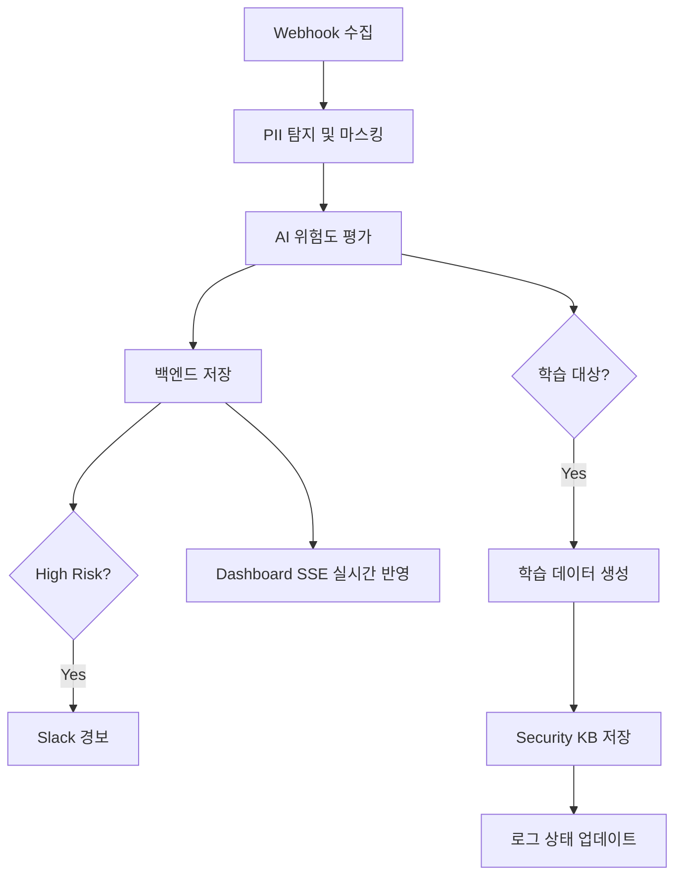
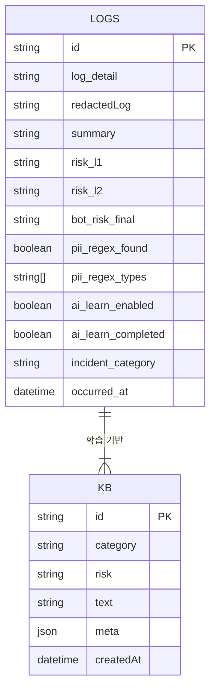
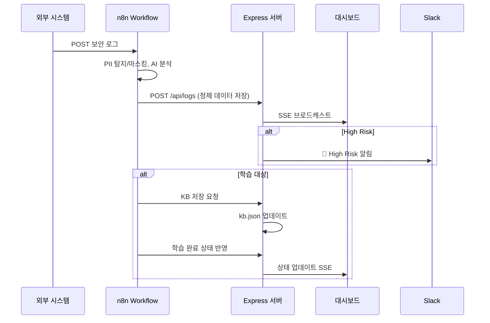

# 🧠 AIM SECURITYFLOW

## *Aim the Security of Finance*

### **AI 기반 금융 보안 로그 자율 분석·학습 파이프라인**

---

# 🚀 SecureFlow — AI 자율 학습 보안 파이프라인

**(AIM: AI + IM)**
**2025 AI Agent 해커톤 공식 출품작**

SecureFlow는 금융·기업 환경에서 발생하는 보안 로그를
**AI가 스스로 수집 → 분석 → 판단 → 학습 → 대응하는**
**완전 자동화 보안 파이프라인**입니다.

---

# 🧩 전체 아키텍처 (요약)

```
외부 시스템 → n8n → Upstage Solar / Gemini → Express Backend  
→ Security KB(Vector Store) → React Dashboard (실시간)
```

✔ **PII 자동 탐지 및 제거**
✔ **AI 기반 위험도 분석**
✔ **학습 자동화로 패턴 정교화**
✔ **React 대시보드 실시간 스트리밍 (SSE)**
✔ **금융 보안 시나리오 기반 대응(고위험 Slack 알림)**
✔ **백엔드 + n8n + LLM 조합 AI Agent 구조**

---

# 📦 프로젝트 구조

```bash
im-bank-n8n-agent/
├── backend/                # Express 서버(API, SSE, 로그/KB 저장)
│   ├── server.js           
│   └── data/
│       ├── logs.json       # 실시간 보안 로그 저장
│       └── kb.json         # 학습된 보안 지식베이스
│
├── frontend/               # React 실시간 보안 대시보드
│   ├── src/App.js
│   ├── src/App.css
│
├── n8n-workflows/          # PII 탐지~AI 분석~학습 자동화 전체 워크플로
├── README.md
└── .github/workflows/ci.yml
```

---

# ⚙️ 주요 기능 (핵심 요약)

| 기능                                         | 설명                               |
| ------------------------------------------ | -------------------------------- |
| 🔍 **정규식 기반 PII 탐지 + 자동 마스킹**              | 이메일·전화·주민번호·카드번호 식별 → `[MASKED]` |
| 🧠 **AI 분석(Upstage Solar Pro 2 / Gemini)** | 위험도·카테고리·원인 생성                   |
| 📚 **Security KB 자동 학습**                   | PII 제거된 요약 데이터만 벡터스토어에 저장        |
| 💾 **로그 저장(Express JSON Storage)**         | logs.json / kb.json              |
| 🔄 **완전자동 n8n Workflow Engine**            | Webhook → 분석 → 저장 → 학습 → 상태 업데이트 |
| 📊 **React 실시간 대시보드**                      | SSE 기반 실시간 log push              |
| 🚨 **High Risk Alert**                     | Slack / Email 자동 경보              |
| 🧼 **백업 데이터 Sanitizer**                    | XLSX 백업 시 PII 완전 제거              |

---

# 🔗 주요 API 엔드포인트

| Method | Endpoint                | 설명              |
| ------ | ----------------------- | --------------- |
| POST   | `/api/logs`             | n8n → 새로운 로그 저장 |
| GET    | `/api/logs`             | 모든 로그 목록 조회     |
| PUT    | `/api/logs/:id`         | 학습 완료 상태 업데이트   |
| POST   | `/security-kb`          | 보안 지식베이스 등록     |
| GET    | `/security-kb/examples` | 유사 사례 조회        |
| GET    | `/events`               | SSE 기반 실시간 스트림  |

---

# 🧰 기술 스택

| 영역             | 스택                                   |
| -------------- | ------------------------------------ |
| **Backend**    | Node.js (Express), SSE, JSON Storage |
| **Workflow**   | n8n (LLM + Regex + 자동화 파이프라인)        |
| **AI 분석**      | Solar Pro 2, Gemini 1.5 Flash        |
| **Frontend**   | React, Tailwind, Chart.js            |
| **Infra**      | Naver Cloud Server, Docker           |
| **Data Store** | logs.json, kb.json                   |

---

# 🧩 전체 파이프라인 Diagram



---

# 🧬 ERD (보안 로그 + 학습 KB)



---

# 🔄 시퀀스 다이어그램



---

# 🧼 백업 Sanitizer (12H 자동 백업)

✔ 12시간마다 동작
✔ IF 조건으로 기간별 백업
✔ **PII 제거된 redactedLog만 XLSX로 변환**
✔ Naver SMTP로 암호화 TLS 메일 발송
✔ 내부 서버에도 동시에 저장 가능

---

# 💻 실행 방법

```bash
cd backend
npm install
node server.js

cd ../frontend
npm install
npm run dev
```

대시보드: `http://서버IP:5173`
API: `http://서버IP:3001`

---

# 🧠 심사위원 Q&A 대비 핵심

### ✔ “원본 로그를 학습시키나요?” → **NO**

LLM 학습에는
**PII 제거 + 요약된 정제 데이터만** 사용합니다.

### ✔ “하루 수천건 들어와도 돌아가나요?”

n8n 기반 비동기 워크플로 → 병렬 처리 가능
백엔드는 JSON 스토리지지만 파일 분리 확장 쉬움.

### ✔ “이 시스템의 목표는?”

AI가 “스스로 보안 로그를 읽고, 판단하고, 배운다”.
**인간 없이 자동화되는 SOC의 프로토타입**.

---

# 👥 팀 AIM 소개

| 항목  | 내용                               |
| --- | -------------------------------- |
| 팀명  | AIM (AI + IM)                    |
| 슬로건 | *Aim the Security of Finance*    |
| 비전  | **AI 기반 금융 보안 자동화**              |
| 역할  | AI / Backend / n8n / Frontend 통합 |

---

# © 2025 AIM SecurityFlow Team

*“Aim the Security of Finance.”*

---
