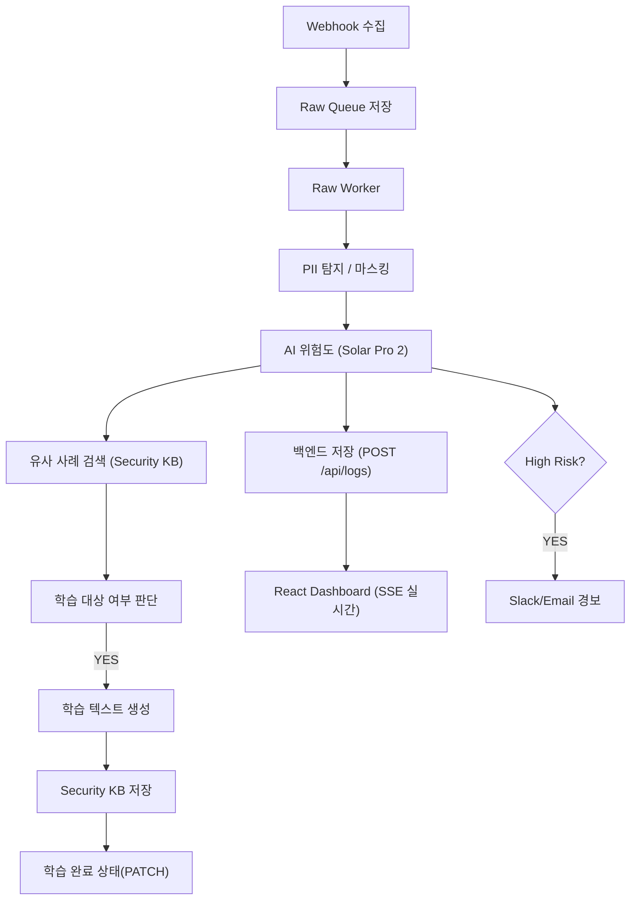
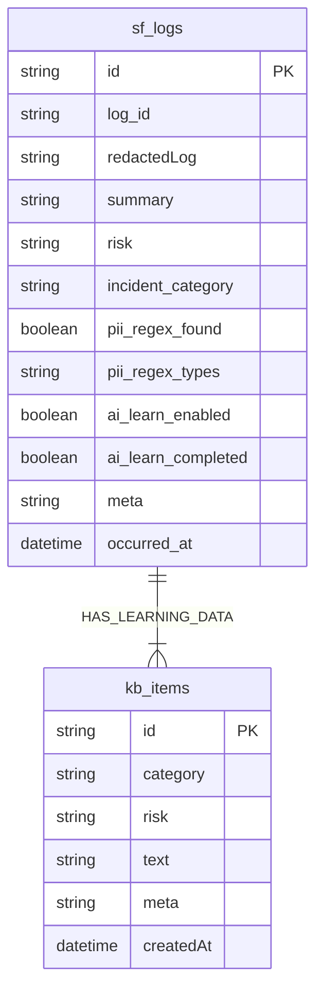

---

# 🧠 AIM SECURITYFLOW

### **Aim the Security of Finance**

### **AI 기반 금융 보안 로그 자율 분석·학습 파이프라인**

**2025 AI Agent 해커톤 출품작 – AIM 팀(AI + IM)**

SecureFlow는 금융·기업 환경의 보안 로그를
**AI가 스스로 수집 → 분석 → 판단 → 학습 → 대응**하는 완전 자동화 보안 분석 파이프라인입니다.

---

# 🚀 SecureFlow Overview

SecureFlow는 다음을 완전 자동으로 수행합니다:

* **정규식 기반 PII(개인정보) 탐지 및 100% 마스킹**
* **Upstage Solar Pro 2 기반 위험도·카테고리 자동 분석**
* **Raw Queue 기반 안정적 수집 → Worker 기반 분석**
* **학습 대상 자동 선별 → Security KB 저장 → 상태 업데이트**
* **Express + SQLite 기반 백엔드 (secureflow.db)**
* **SSE 기반 실시간 대시보드**
* **12시간·24시간 자동 백업(CSV) + Email 발송**
* **Raw Queue Watchdog 기반 장애 자동 복구(Self-Healing)**

---

# 🧩 시스템 아키텍처

```
[외부 시스템] 
     ↓  Webhook
┌──────────────────────────┐
│        n8n Engine        │
│ Raw Collector            │
│ Raw Worker               │
│ Raw Queue Watchdog       │
│ Full Analyzer            │
│ PII 탐지 / AI 위험도 분석  │
│ KB 검색 / 학습 처리        │
└──────────────────────────┘
        ↓
┌──────────────────────────────¬
│   Express Backend + SQLite   │
│   secureflow.db              │
│   /api/logs                  │
│   /security-kb               │
│   /events(SSE)               │
└──────────────────────────────┘
        ↓
[React Live Dashboard]
```

---

# 📦 프로젝트 구조 (최신 버전)

```
im-bank-n8n-agent/
│
├── backend/
│   ├── server-sqlite.js        # Express API + SQLite + SSE
│   ├── ecosystem.config.js     # PM2 운영 설정
│   └── data/
│       ├── secureflow.db       # 모든 로그/KB 실제 저장소
│       └── (logs.json, kb.json - 사용 안함 / 보관)
│
├── sf_backups/                 # CSV 자동 백업 저장소
│       ├── sf_logs_backup_*.csv
│       └── sf_kb_backup_*.csv
│
├── frontend/
│   ├── src/App.js              # SSE 실시간 UI
│   ├── src/App.css
│
├── n8n-workflows/              # 전체 자동화 파이프라인
│   ├── SecureFlow – Raw Collector.json
│   ├── SecureFlow – Raw Worker.json
│   ├── SecureFlow – Raw Watchdog.json
│   ├── SecureFlow – Learning Worker.json
│   ├── SecureFlow – Full Auto Analyzer.json
│   └── SecureFlow – sf_logs_backup_12h.json
│
└── README.md
```

---

# 📊 저장 구조 요약

| 저장소                        | 설명                           |
| -------------------------- | ---------------------------- |
| **secureflow.db (SQLite)** | 모든 로그·학습 데이터·메타데이터 **실제 DB** |
| **sf_logs**                | AI 분석 결과 + 마스킹 로그 저장         |
| **kb_items**               | AI 생성 학습 텍스트 저장              |
| **sf_backups/*.csv**       | 12h logs / 24h kb 자동 백업      |
| (구) logs.json / kb.json    | SSE 이전 버전 / 현재는 사용 안 함       |

---

# ⚙️ 핵심 기능 요약

| 기능                          | 설명                                                       |
| --------------------------- | -------------------------------------------------------- |
| 🔍 **PII 탐지/마스킹**           | 정규식 기반 → `[EMAIL]`, `[PHONE]`, `[RRN]`, `[CARD]` 등 토큰 처리 |
| 🤖 **AI 위험도 분석**            | Upstage Solar Pro 2 기반 High/Medium/Low/Safe 분류           |
| 📚 **Security KB 자동 학습**    | High/Medium + PII 없음 → 학습                                |
| 🧠 **Self-Learning**        | 학습된 KB로 다음 로그 정확도 향상                                     |
| 📊 **React 실시간 대시보드**       | SSE 기반 실시간 스트림                                           |
| 🔥 **High Risk 경보**         | Email/Slack 연동                                           |
| 🗃 **Raw Queue 기반 보장 처리**   | 수집-분석 분리로 안정적 처리                                         |
| 🛠 **Raw Queue Watchdog**   | 워커 5분 이상 멈춤 → 자동 복구                                      |
| 🧼 **12h Sanitized Backup** | PII 없는 redactedLog만 백업                                   |
| 📧 **백업 파일 이메일 자동 발송**      | csv 첨부로 관리자에게 전송                                         |

---

# 🔗 주요 API (Backend)

| Method    | Endpoint                       | 설명          |
| --------- | ------------------------------ | ----------- |
| **POST**  | `/api/logs`                    | 분석 결과 저장    |
| **GET**   | `/api/logs`                    | 최근 로그 조회    |
| **POST**  | `/security-kb`                 | 학습 데이터 저장   |
| **PATCH** | `/api/logs/:id/learn-complete` | 학습 완료 처리    |
| **GET**   | `/security-kb/examples`        | 유사 사례 조회    |
| **GET**   | `/events`                      | SSE 실시간 스트림 |

---

# 🧩 전체 파이프라인 (Mermaid)



---

# 🧬 ERD (최신 구조)



---

# 🧼 자동 백업 시스템 (sf_backups)

### ✔ sf_logs (12시간마다)

* redactedLog 기반
* PII 완전 제거
* CSV 생성 후 이메일 첨부

### ✔ sf_kb (24시간마다)

* 학습 데이터 전체 백업
* 7일 이상된 항목 자동 삭제

### ✔ 저장 위치

```
/sf_backups/sf_logs_backup_*.csv
/sf_backups/sf_kb_backup_*.csv
```

---

# 💻 실행 방법

```bash
# Backend
cd backend
npm install
pm2 start ecosystem.config.js

# Frontend
cd frontend
npm install
npm run build
serve -s dist
```

* Dashboard → `http://SERVER_IP:5173`
* API → `http://SERVER_IP:3001`

---

# 🧠 FAQ

### 🔹 개인정보 학습하나요?

**아니요.**
PII가 1%라도 감지되면 → 학습 제외.

### 🔹 SecureFlow는 실제 금융 환경에서도 동작 가능한가?

네. Raw Queue·Worker·Watchdog·SSE는 실제 SOC 모델과 동일합니다.

### 🔹 학습은 어떻게 이루어지나요?

* redacted(마스킹된) 로그만 사용
* AI가 학습 텍스트 생성
* KB 저장 → 다음 요청 판단 시 반영

---

# 👥 팀 AIM

| 항목  | 내용                                  |
| --- | ----------------------------------- |
| 팀명  | AIM (AI + IM)                       |
| 슬로건 | *Aim the Security of Finance*       |
| 역할  | Backend / n8n / Frontend / AI 통합 개발 |
| 목표  | “AI가 보안 로그를 읽고, 판단하고, 학습한다.”        |

---

# © 2025 AIM SecurityFlow

**Aim the Security of Finance.**

---
