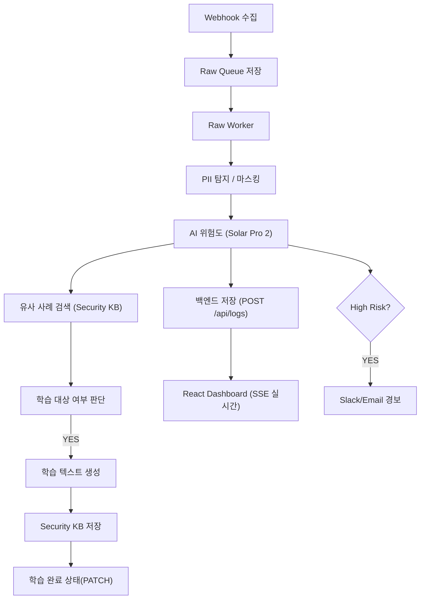
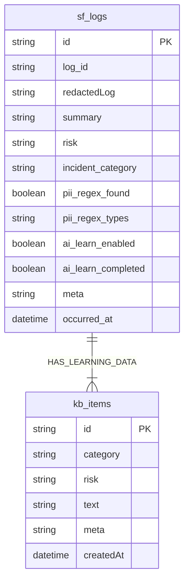

# 🧠 **AIM SECURITYFLOW**

### **Aim the Security of Finance**

### **AI 기반 금융 보안 로그 자율 분석·학습 파이프라인**

**2025 AI Agent 해커톤 출품작 – AIM 팀(AI + IM)**

SecureFlow는 금융·엔터프라이즈 환경에서 발생하는 방대한 보안 로그를
**AI가 스스로 수집 → 분석 → 판단 → 학습 → 대응**까지 수행하는
완전 자동화(Self-Running) 보안 분석 플랫폼입니다.

기업 보안관제를 “자동화 · 무인화 · 자가학습”으로 진화시키는 것이 목표입니다.

---

# 🚀 **SecureFlow Overview**

SecureFlow는 다음 기능을 **사람 개입 없이 24/7 완전 자동**으로 수행합니다:

* **정규식 기반 PII(개인정보) 탐지 및 전량 마스킹**
* **Upstage Solar Pro 2 기반 위험도·카테고리 자동 분석**
* **Raw Queue → Worker 기반의 안정적 대량 처리**
* **학습 대상 자동 선별 → Security KB 자동 축적(Self-Learning)**
* **Express + SQLite 기반 백엔드 with secureflow.db**
* **SSE 기반 실시간 대시보드 스트림**
* **12h / 24h 자동 백업(CSV) + Email 알림**
* **Raw Queue Watchdog 기반 자동 장애 복구(Self-Healing)**

**핵심 철학 → “AI가 읽고, 판단하고, 학습하는 금융 보안”**

---

# 🧩 **시스템 아키텍처**

```
[외부 시스템] 
     ↓  Webhook
┌──────────────────────────┐
│         n8n Engine       │
│ ─ Raw Collector          │
│ ─ Raw Worker (0/1)       │
│ ─ Raw Queue Watchdog     │
│ ─ Full Analyzer          │
│     ⤷ PII 탐지           │
│     ⤷ AI 위험도 분석      │
│     ⤷ KB 검색            │
│     ⤷ 학습 처리           │
└──────────────────────────┘
        ↓
┌──────────────────────────────┐
│ Express Backend + SQLite     │
│ secureflow.db                │
│ /api/logs                    │
│ /security-kb                 │
│ /events(SSE)                 │
└──────────────────────────────┘
        ↓
[React Live Dashboard]
```

---

# 📦 **프로젝트 구조 (최신 버전)**

```
im-bank-n8n-agent/
│
├── backend/
│   ├── server-sqlite.js        # Express API + SQLite + SSE
│   ├── ecosystem.config.js     # PM2 운영 설정
│   └── data/
│       ├── secureflow.db       # 모든 로그/KB 실제 저장소
│       └── (구 JSON 백업)      
│
├── sf_backups/                 # CSV 자동 백업 저장소
│       ├── sf_logs_backup_*.csv
│       └── sf_kb_backup_*.csv
│
├── frontend/
│   ├── src/App.js              # SSE 실시간 UI
│   ├── src/App.css
│
├── n8n-workflows/
│   ├── 0. 전체 자동 분석 파이프라인.json
│   ├── 1. 원본 로그 수집기 (Raw Log Collector).json
│   ├── 2. Raw Queue Watchdog.json
│   ├── 3. Raw Worker (Queue → Analyzer).json
│   ├── 4. Learning Worker.json
│   ├── 5. 랜덤 인시던트 생성기.json
│   ├── 6. 로그 백업 & 자동정리.json
│   └── 로그 간편 삭제.json
│
└── README.md
```

---

# 📊 **저장 구조 요약**

| 저장소                    | 설명                            |
| ---------------------- | ----------------------------- |
| **secureflow.db**      | 모든 로그·학습 데이터·메타데이터 저장되는 실제 DB |
| **sf_logs**            | AI 분석 결과 + 마스킹 로그 저장          |
| **kb_items**           | AI 생성 학습 텍스트 저장               |
| **sf_backups/**        | CSV 자동 백업 (12h logs / 24h kb) |
| (구) logs.json, kb.json | SSE 이전 버전 — 현재는 사용 안 함        |

---

# ⚙️ **핵심 기능 요약**

| 기능                          | 설명                                                 |
| --------------------------- | -------------------------------------------------- |
| 🔍 **PII 탐지/마스킹**           | 정규식 기반 → `[EMAIL]`, `[PHONE]`, `[RRN]`, `[CARD]` 등 |
| 🤖 **AI 위험도 분석(Solar)**     | High/Medium/Low/Safe 자동 분류                         |
| 📚 **Security KB 자동 학습**    | High/Medium + PII 없음 → 학습 대상                       |
| 🧠 **Self-Learning Loop**   | 학습된 KB가 다음 분석에서 자동 활용                              |
| 📊 **SSE 실시간 대시보드**         | 신규 로그·학습·경보 실시간 스트림                                |
| 🔥 **High Risk 경보**         | Email/Slack 자동 알림                                  |
| 🗃 **Raw Queue 구조**         | 수집-분석 분리 → 폭주 상황에서도 안정                             |
| 🛠 **Watchdog**             | Worker 5분 정지 → 자동 재시도·격리                           |
| 🧼 **12h Sanitized Backup** | PII 제거된 redactedLog만 백업                            |
| 📧 **자동 이메일 발송**            | 백업 파일 첨부하여 관리자에게 자동 전달                             |

---

# 🔗 **주요 API (Backend)**

| Method    | Endpoint                       | 설명          |
| --------- | ------------------------------ | ----------- |
| **POST**  | `/api/logs`                    | 분석 결과 저장    |
| **GET**   | `/api/logs`                    | 최근 로그 조회    |
| **POST**  | `/security-kb`                 | 학습 데이터 저장   |
| **PATCH** | `/api/logs/:id/learn-complete` | 학습 완료 처리    |
| **GET**   | `/security-kb/examples`        | 유사 사례 조회    |
| **GET**   | `/events`                      | SSE 실시간 스트림 |

---

# 🧩 **전체 파이프라인 (Mermaid)**



---

# 🧬 **ERD (최신 구조)**



---

# 🧼 **자동 백업 시스템**

### ✔ **sf_logs (12시간)**

* PII 제거된 redactedLog 기반
* CSV 파일 생성 후 이메일 자동 발송

### ✔ **sf_kb (매일 03:00)**

* 전체 KB 백업
* 7일 이상 된 KB 자동 삭제

### ✔ 저장 위치

```
/sf_backups/sf_logs_backup_*.csv
/sf_backups/sf_kb_backup_*.csv
```

---

# 💻 **실행 방법**

```bash
# Backend
cd backend
npm install
pm2 start ecosystem.config.js

# Frontend
cd frontend
npm install
npm run build
serve -s dist
```

* Dashboard → `http://SERVER_IP:5173`
* API → `http://SERVER_IP:3001`

---

# 🧠 **FAQ**

### 🔹 개인정보 학습하나요?

**절대 아님.**
PII 탐지되면 → `ai_learn_enabled = false` → 자동 제외됩니다.

### 🔹 금융 환경에서도 사용 가능?

예. 구조 자체가 **SIEM → Raw Queue → Worker → Analyzer** 기반 SOC 모델과 동일.

### 🔹 학습은 어떻게 동작?

* 마스킹된(redacted) 로그만 학습
* AI가 학습 텍스트 생성
* KB 저장 → 다음 위험도 판단에 즉시 반영
  → 시간이 갈수록 정밀도↑

---

# 👥 **팀 AIM**

| 항목  | 내용                                     |
| --- | -------------------------------------- |
| 팀명  | AIM (AI + IM)                          |
| 슬로건 | *Aim the Security of Finance*          |
| 역할  | Backend / n8n Workflow / Frontend / AI |
| 목표  | “AI가 보안 로그를 읽고, 판단하고, 학습한다.”           |

---

# © 2025 AIM SecurityFlow

**Aim the Security of Finance.**

---
