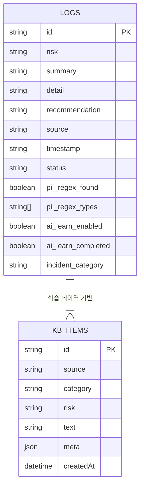
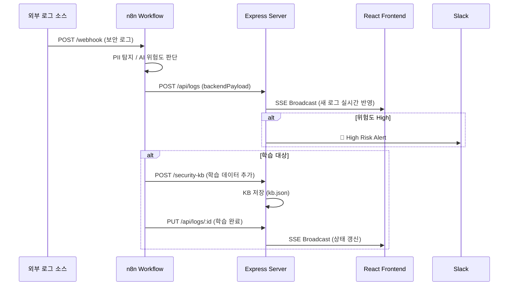

# 🧠 AIM: AI + IM  
## _Aim the Security of Finance_

---

# 🚀 SecureFlow — AI 자율 학습 보안 파이프라인

**AI 기반 개인정보 유출 탐지 및 자동 대응 시스템 (AIM SecureFlow Prototype)**  
2025 AI Agent 해커톤 출품작  

로우코드 워크플로 툴 **n8n**,  
AI 모델 **Upstage Solar Pro 2 / Gemini 1.5**,  
Express + React 기반 백엔드·대시보드로 구성된  
**PII 유출 자동 탐지 / 학습 / 조치형 보안 AI 파이프라인**입니다.

---

## 📦 프로젝트 구조

```bash
im-bank-n8n-agent/
├── backend/                # Express 서버 (API, SSE, KB, 로그 저장)
│   ├── server.js           # 핵심 서버 로직
│   ├── data/
│   │   ├── logs.json       # 보안 로그 저장
│   │   └── kb.json         # 학습용 지식베이스
│   └── ...
│
├── frontend/               # React 실시간 대시보드
│   ├── src/App.js          # SSE 기반 실시간 UI 로직
│   ├── src/App.css         # UI / 카드 / 로그 스타일
│   └── ...
│
├── n8n-workflows/          # PII 탐지~학습 자동화 워크플로 (.json)
├── README.md
└── .github/workflows/ci.yml
```

---

## ⚙️ 핵심 기능

| 기능 | 설명 |
|------|------|
| 🔍 **PII 탐지 및 마스킹** | 정규식 기반으로 이메일·전화·주민번호·카드번호 자동 탐지 후 `[EMAIL]` 등으로 치환 |
| 🧠 **AI 위험도 판단 (Upstage Solar)** | 로그 내용 분석 후 High / Medium / Safe 등급 분류 |
| 🔄 **n8n 자동화 파이프라인** | Webhook → 분석 → 학습 → 상태 업데이트까지 전자동 수행 |
| 🧩 **보안 지식베이스 (KB)** | 과거 인시던트 사례 저장 및 유사 패턴 검색 |
| 📊 **React 실시간 대시보드** | SSE 기반 실시간 갱신 / 위험도 통계 / 학습 현황 시각화 |
| ⚡ **자동 학습 및 상태 갱신** | KB 등록 성공 시 PUT `/api/logs/:id` 로 상태 자동 변경 |

---

## 🔗 주요 엔드포인트

| Method | Endpoint | 설명 |
|--------|-----------|------|
| `POST` | `/api/logs` | n8n → 백엔드 로그 수신 및 저장 |
| `GET` | `/api/logs` | 전체 로그 조회 (최신순) |
| `PUT` | `/api/logs/:id` | 학습 완료 상태 갱신 |
| `POST` | `/security-kb` | 학습 데이터 저장 |
| `GET` | `/security-kb/examples` | 유사 학습 사례 조회 |
| `GET` | `/events` | SSE 실시간 로그 스트림 |

---

## 🧰 기술 스택

| 영역 | 사용 기술 |
|------|------------|
| **Backend** | Node.js (Express), JSON Storage, SSE |
| **Frontend** | React + Tailwind, Chart.js |
| **Automation** | n8n Workflow Engine |
| **AI 분석** | Upstage Solar Pro 2, Gemini 1.5 |
| **Infra** | Naver Cloud (포트 3001 / 5173), Docker |
| **DB/스토리지** | 파일형 로그 저장소 (logs.json / kb.json) |

---

## 🧩 전체 파이프라인 요약

```
[Webhook 수집]
   ↓
[PII 탐지 및 마스킹]
   ↓
[AI 위험도 평가]
   ↓
[결과 병합 + 백엔드 저장]
   ↓
[High 위험 Slack 알림]
   ↓
[학습 대상 자동 분기]
   ↓
[학습 텍스트 생성 → KB 등록]
   ↓
[학습 완료 상태 자동 갱신]
```

---

## 🧱 ERD (Entity Relationship Diagram)



---

## 🔄 Sequence Diagram (n8n → Server → Dashboard)



---

## 💻 실행 방법

```bash
# 1️⃣ 백엔드 실행
cd backend
npm install
node server.js

# 2️⃣ 프론트엔드 실행
cd ../frontend
npm install
npm run dev
```

대시보드 접속: [http://175.45.194.202:3000](http://175.45.194.202:300)  
API 서버: [http://175.45.194.202:300](http://175.45.194.202:300)

---

## 👥 팀 정보

| 팀명 | AIM (AI + IM) |
|------|----------------|
| 모토 | _Aim the Security of Finance_ |
| 구성 | AI / Backend / n8n / Frontend 각 담당 협업 |
| 비전 | “AI가 로그를 읽고, 판단하고, 학습한다.” |

---

© 2025 **AIM SecurityFlow Team**. All Rights Reserved.
