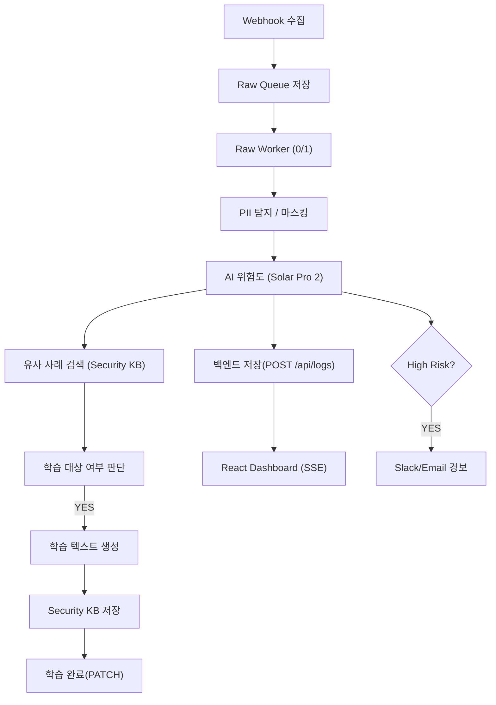
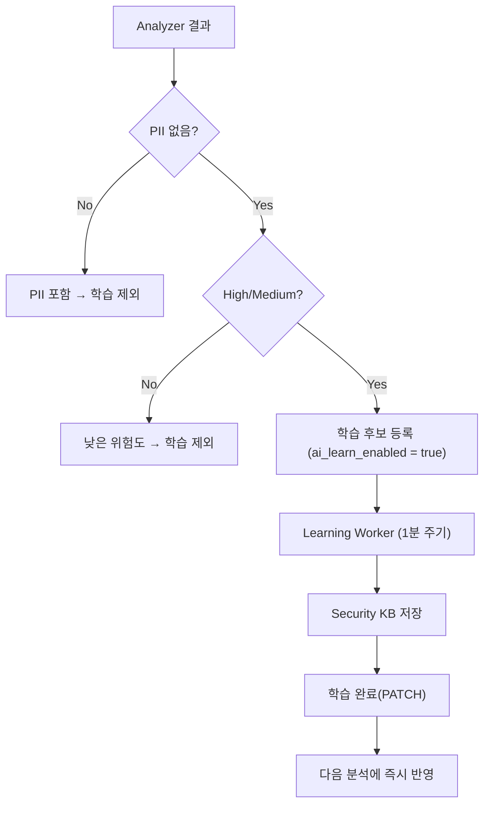

---

# 🧠 AIM SECURITYFLOW

### **Aim the Security of Finance**

### **AI 기반 금융 보안 로그 자율 분석·학습 파이프라인**

**2025 AI Agent 해커톤 출품작 – AIM 팀(AI + IM)**

SecureFlow는 금융·기업 환경의 방대한 보안 로그를
**AI가 스스로 수집 → 분석 → 판단 → 학습 → 대응**하는
완전 자동화(Self-Running) 보안 분석 플랫폼입니다.

오늘날 보안 로그는 공격 복잡도 증가, 트래픽 폭주, 시스템 다양화로 인해
사람이 실시간으로 판단하기엔 물리적 한계가 존재합니다.
SecureFlow는 이를 해결하기 위해 **AI 기반 자기 개선(Self-Improving) 구조**로 설계되었습니다.

---

# 🚀 SecureFlow Overview

SecureFlow는 다음을 **24/7 무인 자동으로 수행**합니다:

* 🔍 **정규식 기반 PII 탐지 및 100% 마스킹**
* 🤖 **Upstage Solar Pro 2 기반 위험도·카테고리 분석**
* 📥 **Raw Queue 기반 안정적 수집 → Worker 기반 병렬 처리**
* 📚 **학습 대상 자동 선별 → Security KB 저장 → 재학습**
* 🧠 **Self-Learning 기반 판단 정확도 지속 상승**
* 🖥 **Express + SQLite 백엔드 + SSE 기반 실시간 대시보드**
* 🧼 **12h / 24h 자동 백업 + Email 자동 발송**
* 🛠 **Raw Queue Watchdog 기반 자동 장애 복구(Self-Healing)**

---

# 🧩 시스템 아키텍처

```
[외부 시스템] 
     ↓ Webhook
┌──────────────────────────┐
│         n8n Engine       │
│  Raw Collector           │
│  Raw Worker (0/1)        │
│  Raw Queue Watchdog      │
│  Analyzer Pipeline       │
│    ├─ PII 탐지           │
│    ├─ Solar 위험도       │
│    ├─ KB 검색            │
│    └─ 학습 판단           │
└──────────────────────────┘
        ↓
┌──────────────────────────────┐
│      Express Backend         │
│        secureflow.db         │
│  /api/logs /security-kb      │
│  /metrics /events (SSE)      │
└──────────────────────────────┘
        ↓
   React Live Dashboard
```

---

# ⚙️ 전체 데이터 흐름



---

# 🏗 프로젝트 구조

```
im-bank-n8n-agent/
│
├── backend/
│   ├── server-sqlite.js
│   ├── ecosystem.config.js
│   └── data/
│       ├── secureflow.db
│
├── sf_backups/
│       ├── sf_logs_backup_*.csv
│       └── sf_kb_backup_*.csv
│
├── frontend/
│   ├── src/App.js
│   ├── src/App.css
│
├── n8n-workflows/
│   ├── 0. Main Auto Analysis.json
│   ├── 1. Raw Log Collector.json
│   ├── 2. Raw Queue Watchdog.json
│   ├── 3. Raw Worker.json
│   ├── 4. Learning Worker.json
│   ├── 5. Incident Generator.json
│   └── 6. Log Backup & Cleanup.json
│
└── README.md
```

---

# 📊 저장 구조 요약

| 저장소               | 설명                             |
| ----------------- | ------------------------------ |
| **secureflow.db** | 모든 로그·KB·운영 메타데이터 저장           |
| **sf_logs**       | Analyzer 결과 + 마스킹 로그           |
| **kb_items**      | Self-Learning KB 텍스트 저장        |
| **sf_backups/**   | CSV 백업 저장소 (logs 12h / kb 24h) |

---

# 🧠 Self-Learning Loop



### 📌 정확도 상승 이유

* High/Medium 중 “PII 없는 로그”만 학습
* Redacted(마스킹된) 텍스트 기반 KB 생성
* 다음 요청의 Solar Pro 2 결과를 **후처리·보완**
* 반복 로그/유사 패턴 판단 정확도 지속 증가

---

# 🔗 주요 API

| Method | Endpoint                       | 설명          |
| ------ | ------------------------------ | ----------- |
| POST   | `/api/logs`                    | 분석 결과 저장    |
| POST   | `/security-kb`                 | 학습 데이터 등록   |
| PATCH  | `/api/logs/:id/learn-complete` | 학습 완료       |
| GET    | `/events`                      | SSE 실시간 스트림 |
| GET    | `/security-kb/examples`        | 유사 사례 검색    |

---

# 🧼 자동 백업 시스템

### ✔ sf_logs (12시간)

* PII 제거된 redactedLog 기반 CSV 백업
* 오래된 로그 자동 삭제

### ✔ sf_kb (매일 03:00)

* KB 전체 백업
* 7일 초과 항목 자동 삭제

---

# 💻 실행 방법

```bash
cd backend
npm install
pm2 start ecosystem.config.js

cd frontend
npm install
npm run build
serve -s dist
```

Dashboard → `http://SERVER_IP:5173`
Backend → `http://SERVER_IP:3001`

---

# 👥 팀 AIM

| 항목 | 내용                               |
| -- | -------------------------------- |
| 팀명 | AIM (AI + IM)                    |
| 목표 | Aim the Security of Finance      |
| 역할 | Backend / n8n / Frontend / AI 통합 |

---

# © 2025 AIM SecurityFlow

**Aim the Security of Finance.**

---

필요한 거 말해! 💛
