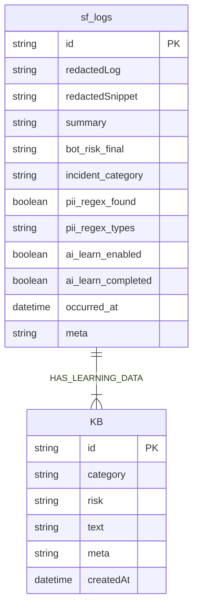

# 🧠 AIM SECURITYFLOW

## *Aim the Security of Finance*

### **AI 기반 금융 보안 로그 자율 분석·학습 파이프라인**

**2025 AI Agent 해커톤 출품작 – AIM 팀(AI + IM)**
SecureFlow는 금융·기업 보안 환경의 보안 로그를
**AI가 스스로 수집 → 분석 → 판단 → 학습 → 대응**하는 완전 자동화 보안 분석 파이프라인입니다.

---

# 🚀 SecureFlow Overview

SecureFlow는 다음을 완전 자동으로 수행합니다:

* **정규식 기반 PII(개인정보) 탐지 및 100% 마스킹**
* **Solar Pro 2 기반 위험도·카테고리 분석**
* **n8n 기반 엔드-투-엔드 자동화 워크플로**
* **학습 대상 자동 분기 → Security KB 저장 → 상태 업데이트**
* **Express 백엔드 + SSE 실시간 스트림 기반 대시보드**
* **12시간 주기 Sanitized 로그 백업(XLSX) + 이메일 발송**
* **Slack/Email 기반 High Risk 경보**

---

# 🧩 시스템 아키텍처

```
[외부 시스템] 
     ↓  Webhook
┌───────────────────────┐
│         n8n           │
│ Raw Collector         │
│ Raw Worker            │
│ PII 탐지 / 마스킹       │
│ 위험도·카테고리 분석     │
│ 학습 큐 처리            │
│ KB 저장 / 상태 업데이트   │
└───────────────────────┘
        ↓
┌──────────────────────────────┐
│     Express Backend(API)     │
│ logs.json   ← 대시보드 캐시    │
│ kb.json     ← Security KB     │
│ SSE /events → 실시간 대시보드   │
└──────────────────────────────┘
        ↓
[React Live Dashboard]
```

---

# 📦 프로젝트 구조 (최신)

```
im-bank-n8n-agent/
│
├── backend/
│   ├── server.js               # Express API / SSE / KB 관리
│   └── data/
│       ├── logs.json           # 대시보드용 캐싱 (원본 PII 없음)
│       └── kb.json             # 보안 학습 지식베이스
│
├── frontend/
│   ├── src/App.js              # SSE 실시간 UI
│   ├── src/App.css
│
├── n8n-workflows/
│   ├── SecureFlow – Raw Collector.json
│   ├── SecureFlow – Raw Worker.json
│   ├── SecureFlow – Raw Watchdog.json
│   ├── SecureFlow – 학습 워커.json
│   ├── SecureFlow – Full Auto Analysis.json
│   └── SecureFlow – sf_logs_backup_and_cleanup_12h.json
│
└── README.md
```

### 📝 저장 구조 요약 (중요)

| 저장 위치                        | 역할                             |
| ---------------------------- | ------------------------------ |
| **n8n Data Table (sf_logs)** | 모든 분석 결과 저장하는 “실제 DB”          |
| **backend/data/logs.json**   | 대시보드용 캐시 / SSE 반영용             |
| **backend/data/kb.json**     | Security KB 학습 데이터 저장          |
| **백업 XLSX**                  | redactedLog 기반 Sanitized 로그 백업 |

---

# ⚙️ 핵심 기능

| 기능                   | 설명                                                 |
| -------------------- | -------------------------------------------------- |
| 🔍 PII 탐지·마스킹        | 이메일, 전화번호, 주민번호, 카드번호 자동 탐지 후 `[EMAIL]` 등 토큰으로 마스킹 |
| 🧠 AI 위험도 분석         | Solar Pro 2 기반 위험도·카테고리 분류                         |
| 🔄 AI 자동화            | Webhook → 분석 → 학습 → KB 저장 → 상태 동기화                 |
| 📚 KB 자동 학습          | PII 없는 로그만 학습, 과거 패턴 기반 판단 고도화                     |
| 📊 실시간 대시보드(SSE)     | 위험도 변화·학습 상태 즉시 반영                                 |
| 🚨 High Risk 경보      | Slack/Email 알림 트리거                                 |
| 🧼 12시간 Sanitized 백업 | redactedLog 기반 XLSX → 메일 + 내부 저장                   |

---

# 🔗 주요 API (Backend)

| Method   | Endpoint                | 설명               |
| -------- | ----------------------- | ---------------- |
| **POST** | `/api/logs`             | n8n이 분석 결과 push  |
| **GET**  | `/api/logs`             | 대시보드용 로그 조회      |
| **PUT**  | `/api/logs/:id`         | 로그 학습 완료 상태 업데이트 |
| **POST** | `/security-kb`          | KB 항목 저장         |
| **GET**  | `/security-kb/examples` | 유사 사례 조회         |
| **GET**  | `/events`               | SSE 실시간 스트림      |

---

# 🧩 전체 파이프라인 (Mermaid)

```mermaid
flowchart TD
    A[Webhook 수집] --> B[전처리 · 스키마 정규화]
    B --> C[PII 탐지 및 마스킹]
    C --> D[위험도 분류 (Solar Pro 2)]
    D --> E[백엔드 저장 / SSE 스트림]
    
    D --> F{학습 대상?}
    F -->|YES| G[학습 텍스트 생성]
    G --> H[Security KB 저장]
    H --> I[상태 업데이트 (PUT /api/logs/:id)]

    D --> J{High Risk?}
    J -->|YES| K[Slack/Email 경보]

    E --> L[React Dashboard (실시간)]
```

---

# 🧬 ERD (최신)



---

# 🧼 12시간 자동 백업 (Sanitized XLSX)

SecureFlow는 **원본 PII가 포함된 로그를 절대 백업하지 않습니다.**

백업 워크플로는:

1. 12시간 범위 로그 조회(sf_logs)
2. `redactedLog` 기반 Sanitizer 재마스킹
3. Convert → XLSX 파일 생성
4. SMTP(TLS)로 관리자 이메일 발송
5. `/sf_backups/` 디스크에도 저장(Optional)

✔ **PII 0byte 보장**
✔ **대회 심사 기준 안전성 충족**

---

# 💻 실행 방법

```bash
# Backend
cd backend
npm install
node server.js

# Frontend
cd frontend
npm install
npm run dev
```

* Dashboard: `http://<SERVER_IP>:5173`
* API Server: `http://<SERVER_IP>:3001`

---

# 🧠 심사위원 Q&A 대비

### 🔹 Q. 개인정보를 학습에 사용하나요?

**절대 사용하지 않습니다.**
모든 로그는 PII 정규식 검사 후
→ PII 있으면 학습 제외
→ PII 없는 redactedLog만 학습

### 🔹 Q. 실제 금융 환경에 적용 가능한가요?

네.
비동기 Queue/Worker 구조, SSE 대시보드, 자동 학습 파이프라인은
실제 SOC 운영 모델과 동일합니다.

### 🔹 Q. 학습은 어떻게 이뤄지나요?

1. AI가 로그 분석
2. redactedLog 기반 “학습 텍스트 생성”
3. Security KB 저장
4. 이후 유사 사건 비교에 사용 → 탐지 정확도 향상

---

# 👥 팀 AIM

| 항목  | 내용                                 |
| --- | ---------------------------------- |
| 팀명  | AIM (AI + IM)                      |
| 슬로건 | *Aim the Security of Finance*      |
| 역할  | Backend / n8n / AI / Frontend 통합개발 |
| 목표  | “AI가 보안 로그를 읽고, 판단하고, 학습한다.”       |

---

# © 2025 AIM SecurityFlow

*Aim the Security of Finance.*

---
